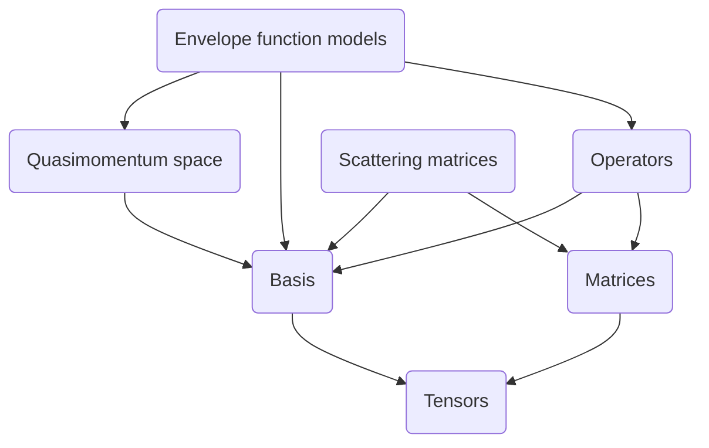
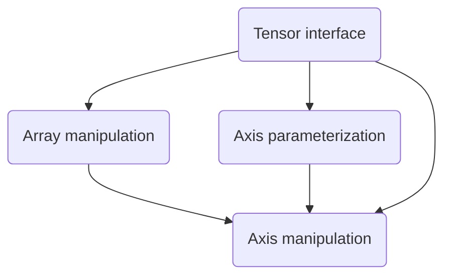

# Формализуем многослойную (многоуровневую) архитектуру

## 1. Рефлексия по изучению материала
Первая мысль была, что это очевидная вещь, просто здравый смысл.
Только этого "здравого смысла" придерживаются не все.
Буквально на днях узнал, что, есть японские автомобили,
где открывание капота имеет электрический привод.
То есть, фундаментальный "слой", отвечающий за ремонтопригодность электрики
(физический доступ к аккумулятору и блоку предохранителей),
зависит от исправности "слоя" этой самой электрики.
Вопрос с севшим аккумулятором "решается" наличием специального гнезда (!)
для подключения внешнего источника питания.

Если уж подобные вещи воплощаются "в железе",
то в программах рассчитывать на чей-то "здравый смысл" вообще не приходится.
Тем более, что циклы зависимостей получаются спонтанно.
На днях разбирал модуль из более чем тысячи строк на четыре части.
Оказалось, что подсистемы, которые я видел слабо связанными на уровне логики,
на уровне кода имеют циклические зависимости.
Для распутывания этой системы пришлось приложить некоторые усилия,
и я это сделал, потому что абсолютно уверен, что явные циклические зависимости
ни к чему хорошему не приведут.
Однако, лет 10 назад я бы оставил всё как есть, потому что лень.

Вывод такой: полезно разбирать системы на части и при этом следить, чтобы
зависимости имели вид направленного ациклического графа.

## 2. Поддержка МУРА в моём проекте

### 2.1. Тензоры
Нижний уровень.

Данная подсистема, отвечает за операции с осями многомерных массивов,
например, с её помощью удобно склеивать все строки (или столбцы) матрицы
в один большой вектор.

Вторая её функция - поддержка создания новых АТД с более сложным поведением,
где у осей массива есть ещё какой-то смысл, связанный с предметной областью.

В принципе, эту подсистему можно скопировать из проекта
и использовать как отдельную библиотеку.

### 2.2. Матрицы и базисы
Две независимые подсистемы второго уровня.

Матрицы помогают выделять среди осей строки и столбцы, и использовать эту
информацию, например, для вычисления обратных матриц
или собственных значений и векторов,

Базисы помогают привязывать к осям объекты,
которые, как минимум, задают размеры массива.

Любой из этих модулей можно скопировать в отдельный пакет,
и он будет работать, если обеспечить доступ к тензорам (пункт 2.1.).

### 2.3. Прикладные типы
Это целая куча независимых модулей, которые позволяют решать разные небольшие
типовые задачи из предметной области (в моём случае - квантовой механики).

Один из примеров - матрица квантового оператора, которая является тензором,
поддерживающим и матричные оси и базисы.
Она использует оба модуля предыдущего уровня (2.2.) и тензоры (2.1.).

### 2.4. Скрипты для расчётов
Разные комбинации прикладных типов из пункта 2.3. для решения конкретных задач.

Этот слой уже физически отделён от основной библиотеки.
Предполагается, что изменения здесь будут происходить на порядок интенсивнее,
ведь для каждой задачи нужен новый скрипт.

### Вывод
Изначально планировалось независимое развёртывание только базовой библиотеки
и скриптов.
Привычка избегать явных (в виде ссылок на модули, типы и функции)
циклических зависимостей привела к тому, что возможно извлечь и развернуть
независимо более мелкие слои уже внутри библиотеки.

Подсистема тензоров - первый кандидат для повтороного использования.
Много времени ушло на то, чтобы сделать её максимально абстрактной
и вынести матрицы и базисы в отдельный слой.
Теперь я вижу, что оно того стоило, в том числе и в плане полученного опыта.

## 3. Диаграмма
Диаграмма зависимостей основных модулей

Внутреннее устройство подсистемы тензоров
(про её распутывание упоминается в пункте 1.):

## Общие выводы
При выполнении этого задания ещё раз просмотрел код проекта и увидел ряд
возможностей для улучшения в плане разделения слоёв.
Например, `Tensor interface` использует достаточно низкоуровневые типы
из `Axis manipulation`, и здесь можно ослабить зависимость между слоями,
переместив часть кода ниже по уровням.
Ещё можно добавить слой между `Tensors` и `Matrices`.
Он заберёт часть сложности из `Operators` и `Evelope function models`,
потому что на новом уровне абстракции разный код станет одинаковым.

Ещё больше укрепился в убеждении, что разделение тензоров, матриц и базисов
было правильным решением и стоило потраченных ресурсов.
В общем случае, не стоит жалеть время и силы для внедрения в проект более
сильных абстракций, если это упрощает архитектуру
(за счёт появления слабо связанных слоёв, например).
