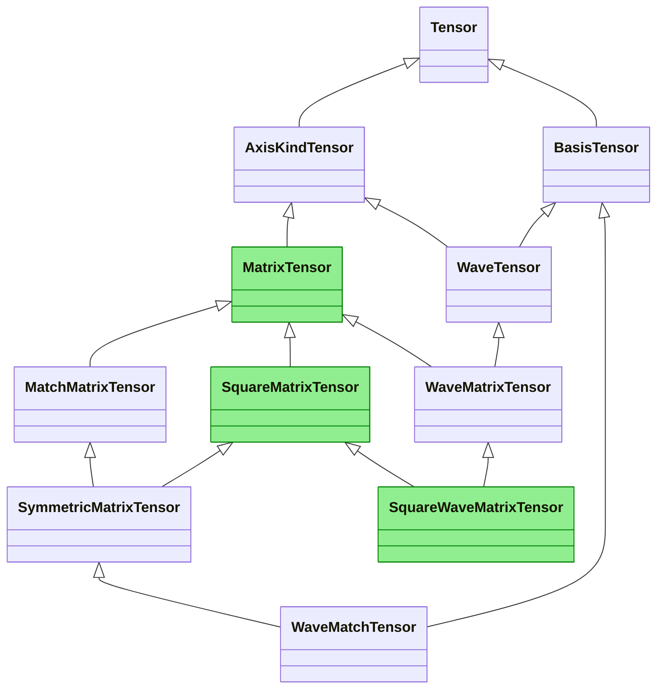
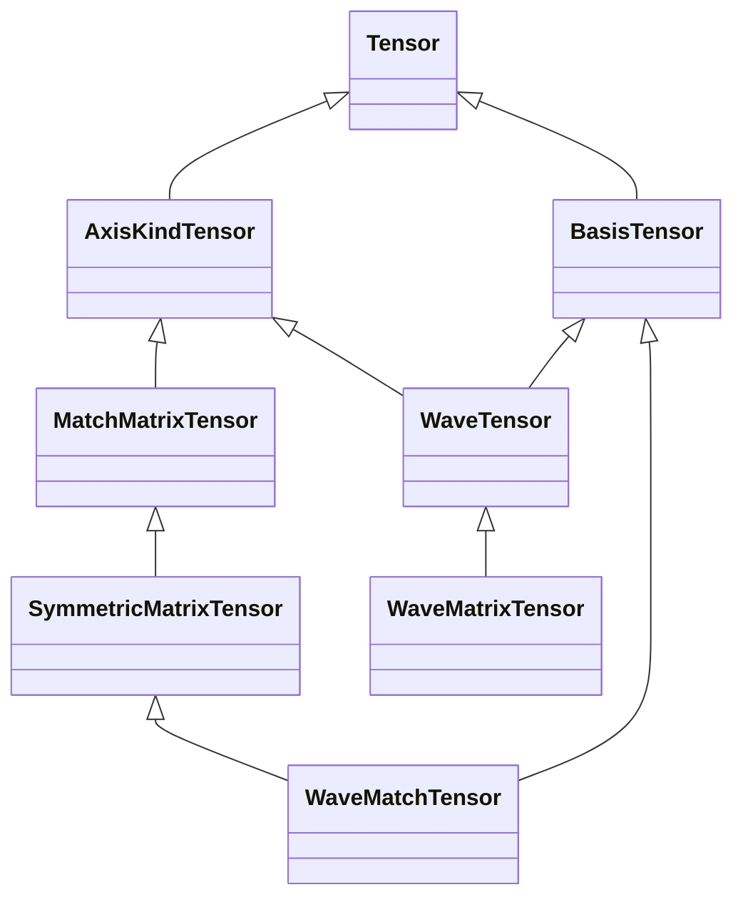
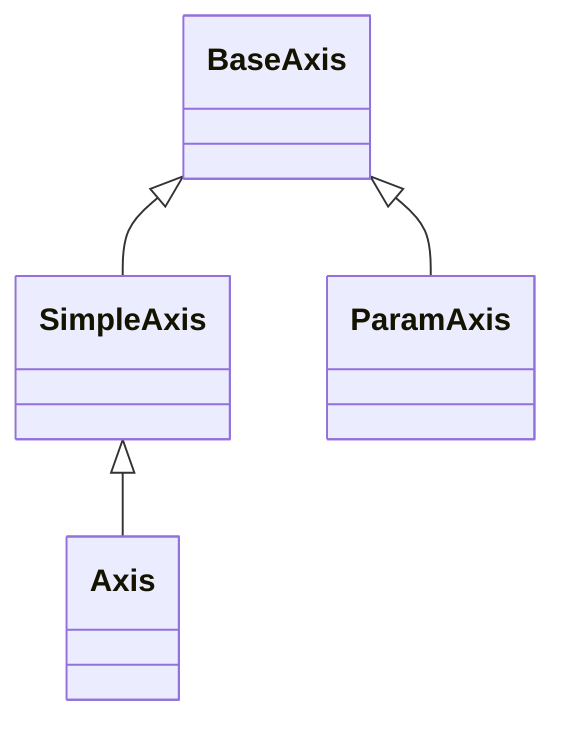
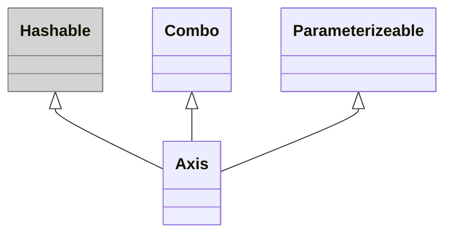

# Обобщаем проектные абстракции

## 1. Рефлексия по теории
```
-- Мы используем статическую типизацию.
-- А что это значит?
-- Это значит, что ты что-то знаешь, даже если ничего не знаешь.
```
Это первый момент, который я для себя отметил.
Речь идёт не о первых версиях языка Fortran,
где великим достижением было различение целых чисел и
и чисел с плавающей точкой.
В современных языках с алгебраическими типами, дженериками и автовыводом типов
на этапе компиляции (или другой формы статического анализа)
происходят самые настоящие вычисления типов данных.
Уже в этот момент, когда программа ещё не запущена,
и мы не знаем конкретных значений,
мы всё равно что-то о них знаем.
В этот момент можно отловить массу ошибок и сэкономить кучу времени.

Абстракция типов данных отображает множество различных значений
в пространство, где они различаются лишь по некоторым свойствам,
которые заранее известны.
Например, если у нас есть интерфейс `Dog` с методом `bark`,
который принимает определённые параметры,
то для переменной этого типа мы знаем
и о наличии метода `bark`, и о типах его параметров.

В контексте компьютерной программы тип -
это прежде всего набор допустимых операций.
Поэтому система типов приложения не обязательно должна быть изоморфна
какой-то интуитивно понятной классификации объектов предметной области.
Хорошая система типов даже может быть контринтуитивной,
поскольку строится на основе операций, или функций.
Например, вместо классов `Dog`, `Fish`, `Bird` и `Duck`
более удобными могут оказаться интерфейсы `Walking`, `Swimming` и `Flying`,
потому что утка - это точно не рыба, хоть и плавает.

Это второй важный момент - система типов должна разрабатываться на основе
операций, а не "интуитивно понятной классификации".
При изучении высшей математики развивается
привычка думать о функциях примерно так же как о числах,
т.е. о сущностях, которые могут объединяться в множества, иметь тип
и подвергаться математическим операциями.
Благодаря этому может развиться и соответствующая интуиция.


## 2. Сокращение иерархии классов

### 2.1 Матрицы не нужны

Класс `MatrixTensor` предоставляет слишком сложный математический объект,
которому в коде пока не нашлось и не предвидится применения.
Фактически, везде где нужны именно матрицы используется `MatchMatrixTensor`.

Для `WaveMatrixTensor` способности именно `MatrixTensor` не нужны,
ему достаточно `AxisKindTensor`.

Ни один из классов `Square...Tensor` не используется и не нужен.
Нужен только `SymmetricMatrixTensor`.

Три зелёных класса в диаграмме - реликты старых версий,
где не было `AxisKindTensor` и `BasisTensor` -
простых и мощных абстракций, которые покрывают большую часть потребностей:



### 2.2 Ось добра

Оси задумывались как **простой** инструмент
для определения порядка индексов в многомерных массивах,
а теперь тут **иерархия из пяти классов**, и все они - оси.
К счастью от этой идеи я отказался в самом начале кодирования.

На самом деле для большинства операций оси не нужны:
  - нужны `Hashable` объекты для определения порядка индексов;
  - нужны `Combo` объекты для математических операций;
  - нужны `Parameterizeable` объекты для передачи дополнительный параметров;
  - нужны `Axis` объекты для хранения имени, которое помогает при
    чтении кода, сериализации и отладке.

Тогда так и надо делать:

Класс `Hashable` серый потому, что это часть стандартной библиотеки,
а не моего кода.

Теперь ось только одна, а остальные функции перемещены в интерфейсы.


### Выводы по работе с кодом
Большая часть работы пока была не с кодом, а с "проектной документацией".
Было обнаружено несколько ошибок проектирования.

Первая - создание слишком сложной сущности `MatrixTensor`,
которая умеет гораздо больше, чем нужно классам-потомкам.
Реализация общего случая в этой сущности гораздо сложнее чем сумма
реализаций частных случаев в потомках.
Решение - отдать то, что действительно нужно,
другому классу (`AxisKindTensor`), а лишнее выкинуть.

Вторая - сохранение после рефакторинга реликтовых классов,
которые больше не используются и не планируются к использованию,
хотя и имеют чёткий математический смысл (`Square...`).
Решение - безжалостно удалить всё лишнее.

Третья - размазывание функционала по иерархии, или нарушение SRP.
В случае многочисленных классов осей (`Axis`)
работа в разных модулях происходит не с частными интерфейсами,
а с классами, от которых нужны далеко не все предоставляемые операции.
Решение - разделение интерфейсов и вынос Точки Сборки
(места, где они объединяются в одной сущности)
за пределы модулей, работающих с отдельными интерфейсами.


## 3. Interface dispatch
Отчасти этот подход используется в 2.2,
где класс `Axis` стал точкой сборки и реализации всех интерфейсов,
которые используются в других модулях.
Класс `Combo`, в свою очередь, тоже собирается из нескольких интерфейсов.
Отличие в том, что здесь интерфейсы идут сразу в комплекте с реализацией,
т.е. это скорее миксины.

В более сложных случаях,
когда для одного интерфейса требуются разные реализации,
можно создавать, например, классы `ComboA` и `ComboB`,
и передавать их в конструктор `Axis`.


## 4. Другие абстракции
Помимо классов и интерфейсов на ум ещё приходит абстракция монады.
Все монады объединяет наличие операции `bind`, которой уже достаточно,
чтобы строить цепочки вычислений.
Конкретная реализация этой операции может быть разной,
но с точки зрения цепочек все монады на одно лицо.

Иными словами, множество всех монад
(вместе с их конкретными значениями и состояниями)
отображается в множество типов монад,
которые отличаются только операцией `bind`.
Вторая абстракция - все типы монад отображаются
в один общий тип `Monad`, про который мы знаем только то,
что у него есть операция `bind` определённого вида.


## Общие выводы
Чем больше мы знаем о коде до его запуска,
тем меньше придётся выяснять о нём после запуска.
Лучше ловить ошибки (и избегать их) на уровне статического анализа,
а не выполнения программы.
Поэтому так важна статическая типизация.
К счастью, явно наблюдается тенденция к её распространению:
TypeScript и CoffeeScript заменяют JavaScript,
развиваются аннотации типов в Python.
К сожалению, требования обратной совместимости и
высокий порог входа в высшую математику тормозят этот процесс.

Когда у нас уже есть типы, можно пойти дальше -
объединять их в новые типы.
Тут появляются иерархии классов, интерфейсы, дженерики и т.п.
Это даже не разные уровни, а разные системы координат.
Где-то важно, что сущности можно складывать, а где-то,
что они хэшируются и могут быть индексами ассоциативного массива.
При этом какой-нибудь операции `sum` может быть не важно
является ли "сложение" математической операцией,
или связыванием монады с функцией.

В какой-то момент абстракции "отрываются от земли"
и уже не имеют явного представления в используемом языке программирования
(в C - раньше, в Haskell - позже).
Тогда обязательно нужен другой механизм формализации того,
что происходит на уровне логики, потому что формализация в коде
**на том же уровне абстракции** уже невозможна,
а без формализации мы не можем доказать корректность.
Тут спасает математика, а кому её не хватает - те развивают её дальше.
