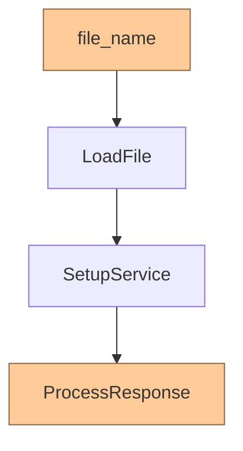
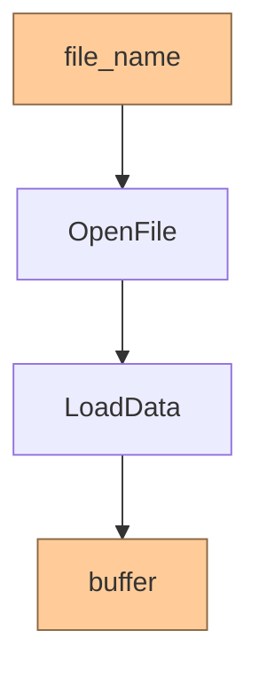

# SRP с т.зр. ФП

## 1. Загрузка и настройка
Файл загружается асинхронно. Если получилось - отправляем данные сервису,
который должен дать асинхронный ответ об успешной обработке или ошибке.
Это всё в одной функции, которая проверяет и результат загрузки, и результат
настройки сервиса.

Вместо этого делаем две функции:
```
LoadFile: (Asset | AssetError)
SetupService: (Asset | AssetError) -> (ServiceResponse | AssetError | SetupError)
```
Теперь просто собираем конвейер:



## 2. Новое состояние
А теперь в предыдущем примере у сервиса два независимых набора ассетов,
каждый из которых может не загрузиться или нормально не настроиться.
Коллеги засунули их оба в одну функцию, и там возникла лишняя зависимость:
второй ассет не грузится, если сломался первый.

Сразу возникает искушение разделить это всё на независимые пайпы, но есть планы
по объединению всего в одном файле, да и параллельная загрузка нескольких файлов
- это не то, чего мы тут хотим.
Загрузка - это одна зона ответственности, нет отдельной загрузки для первого
и второго модуля, а вот настройка у них уже независимая, и тут функции будут разными.


## 3. Файл и буфер
Функция чтения файла проверяет наличие файла, создаёт его дескриптор,
подготавливает особый буфер, предназначенный для межпроцессного обмена данными
(Inter-Process Communication aka IPC) и загружает данные.
При этом последнее действие является низкоуровневым: использует сырые указатели
и требует добавления особых макросов, чтобы удовлетворить компилятор.
Тут смешаны не только разные действия, но и разные уровни абстракции.

На верхнем уровне функция должна выглядеть так:

а внутри `LoadData` вызывается низкоуровневая функция `CopyData`.
Каждая функция может вернуть ошибку вместо результата.


## 4. Старт
Псевдокод:
```C++
void StartScoring(
    string url,
    string title,
    RequestType request_type,
    Service* service,
    DoneCallback done_callback,
    Callback<Scorer*()> get_scorer,
    string page_text) {
  auto [path1_callback, path2_callback, path3_callback] =
      MakeCollectorCallback(Bind(FinishScoring, done_callback, get_scorer));
  service->JustDoIt(url, request_type, path1_callback);
  LaunchPath2(url, title, page_text, path2_callback);
  if (ShouldUsePath3()) {
    service->GetDataForPath3(Bind(ProcessPath3Data, path3_callback));
  } else {
    path3_callback(Unexpected("No way"));
  }
}
```
А Роберт Мартин пишет, что функции даже с двумя аргументами - это плохо.
Тут их семь штук.
Эта функция запускает асинхронные вычисления, настраивает обработчик результата,
и принимает решение по поводу ~~срединного~~ третьего пути.

Дело в том, что эта функция изначально неудачная - этот код вытащили из
класса, который спроектирован в стиле ООП, и поэтому тут торчит такое количество
привязок к этому классу в виде аргументов.
Эта функция - переводчик с внутреннего языка того класса на абстрактный язык
`CollectorCallback`.
Очевидно, простая группировка кода в функции не делает архитектуру более функциональной.
Кое-что, впрочем, тут можно сделать:
```C++
void StartSomething(
    PageData data,
    MetaScorer meta_scorer,
    FinishCallback finish_callback) {
  auto [path1_callback, path2_callback, path3_callback] =
      MakeCollectorCallback(finish_callback);
  meta_scorer->path1(data.url, path1_callback);
  meta_scorer->path2(data.url, data.title, data.page_text, path2_callback);
  meta_scorer->path3(path3_callback);
}
```
Тривиальная? Да! Но не лишняя, теперь это именно переводчик, который
распаковывает `data` и обеспечивает вызов `finish_callback` с нужными аргументами.

## 5. Стоп
Псевдокод:
```C++
void FinishScoring(
    FinallyDoneCallback done_callback,
    Callback<Scorer*()> get_scorer,
    Result1 result1,
    Result2 result2,
    Result3 result3) {
  if (!result1.ok()) {
    done_callback(result1.error());
    return;
  }
  auto verdict = result1.value();

  if (result2.ok()) {
    verdict.add2(result2.value());
  } else {
    LOG(ERROR) << "No 2";
  }

  if (result3.ok()) {
    verdict.add3(result3.value());
  } else {
    LOG(ERROR) << "No 3";
  }

  if (Scorer* scorer = get_scorer()) {
    scorer.process(verdict);
  } else {
    verdict.set_error();
  }

  done_callback(verdict);
}
```
Это вторая половина функции `StartScoring`.
В C++ долго не было корутин, а в нашем проекте не будет ещё дольше.
Скорер нельзя передавать в параметры - он может отвалиться, его запрашиваем
прямо перед использованием.
Ошибку нельзя передать в `done_callback` - у него фиксированная сигнатура,
поэтому тут просто логи.

Что тут можно исправить? Избавить эту функцию от возни со скорером:
```C++
void FinishScoring(
    FinallyDoneCallback done_callback,
    Callback<void(Verdict*)> final_scoring,
    Result1 result1,
    Result2 result2,
    Result3 result3) {
  if (!result1.ok()) {
    done_callback(result1.error());
    return;
  }
  auto verdict = result1.value();

  if (result2.ok()) {
    verdict.add2(result2.value());
  } else {
    LOG(ERROR) << "No 2";
  }

  if (result3.ok()) {
    verdict.add3(result3.value());
  } else {
    LOG(ERROR) << "No 3";
  }

  final_scoring(&verdict);
  done_callback(verdict);
}
```


## Общие выводы
Попытки применить SRP к функциям, порождённым ООП кодом,
ярко подсвечивают его недостатки.

Во-первых, это явная завязка на внешнее состояние
(как с передачей сервиса или запросом скорера)
у функции есть побочные эффекты, которые передаются в виде аргументов.
Корень проблемы - большое количество связанных явных состояний в полях класса,
откуда эта функция родом.
Пока всё это в методах, интерфейс кажется красивым, но вынести код в отдельные
функции напоминает поедание спагетти: берёшь вилкой маленький кусочек,
а за ним тянется треть тарелки.

Во-вторых, это смешивание уровней абстракции.
В C++ создание нового типа требует много "синтаксической соли":
конструкторы, деструкторы, копирование, перемещение, разделение на заголовок
и код, PIMPL, ...
Поэтому в классе все поля лежат вместе, и методы используют их напрямую.
Вот тут ИИ действительно неплохо справляется с рефакторингом,
забирая рутину на себя.

В-третьих, это неявные побочные эффекты - ещё хуже, чем пункт 1.
Почему нельзя просто передать скорер в функцию?
Потому что это какой-то объект с другим владельцем,
ссылающийся на memory-mapped файл с третьим владельцем.
А, да, там ещё обсерверы, которые обновляют файл при горячей загрузке
(приложение может обновлять наборы данных без перезапуска).

Если рассматривать систему с точки зрения архитектуры портов и адаптеров,
то она полностью состоит из адаптеров, а логика затерялась, потому что нет
явных портов.
